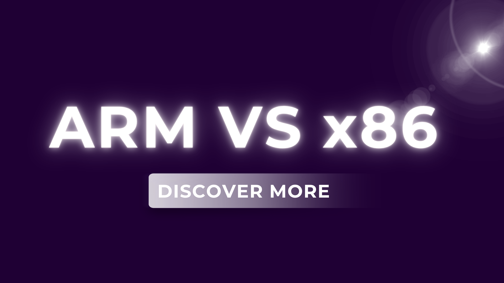
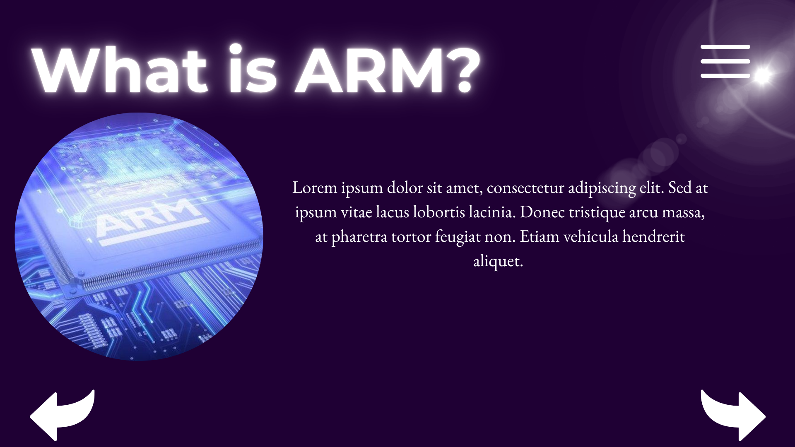
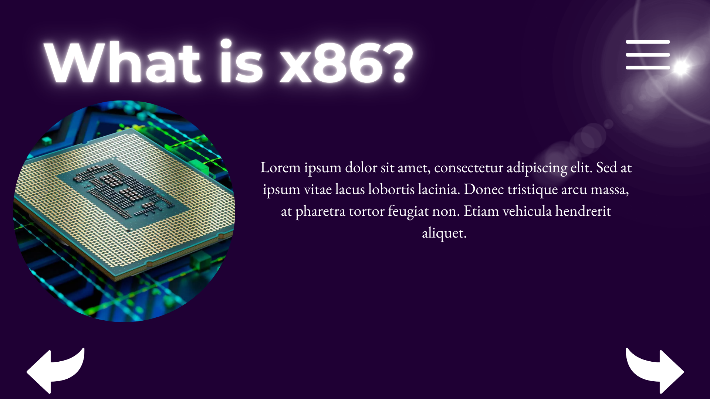
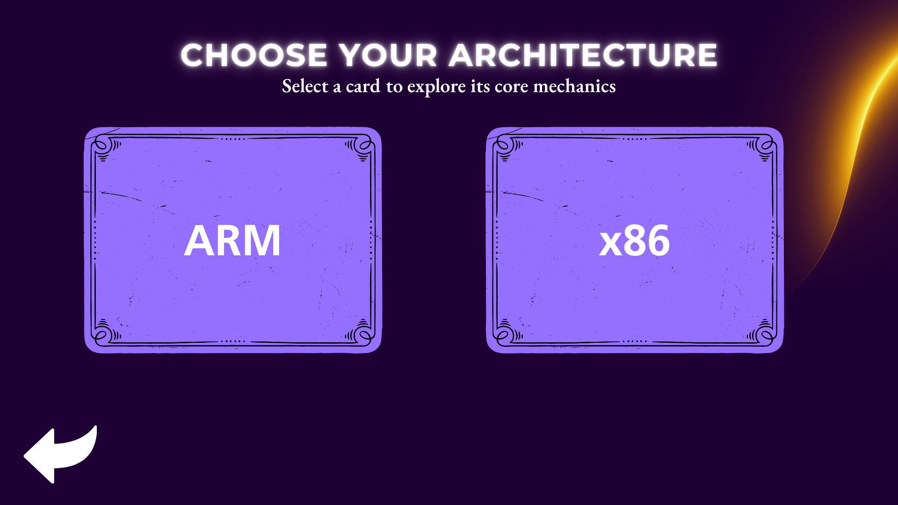
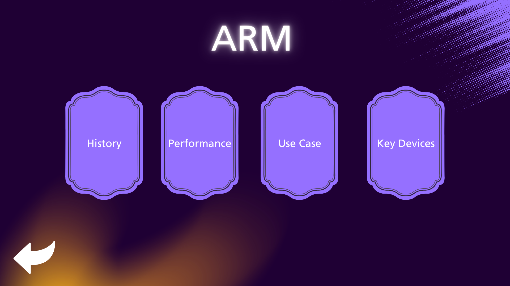

# Computer Architecture Virtual Exhibit 2026: "Computer Architecture are Forever"

**Website Link:** https://zachhallare.github.io/virtual-exhibit-template/arm_vs_x86/

**GitHub Repository:** [GitHub Repository](https://github.com/zachhallare/virtual-exhibit-template)

## ARM vs x86: Interactive Architecture Explorer

**Group 9**
* **Co, Adrian Nathaniel L.**
* **Hallare, Zach Benedict I.**
* **Javier, David Lorenz A.**
* **Lee, Tyrone Julius R.**
* **Tiu, Kyle Thomas E.**

---

## Topic Theme: ARM vs x86 Comparison

When discussing important aspects of a computer system, many individuals tend to think about things like the **central processing unit (CPU)**, **motherboard**, and **random access memory (RAM)**. While these components are crucial, they often overshadow the many other elements that can be just as, if not more, vital to maintaining a computer's functionality. One of these overlooked factors is the computer's **architecture**, which defines the various attributes, such as the **representation of data types** and the **handling of memory**, that dictate how a computer operates at the fundamental level. Without the presence of this structure, computers would essentially be useless as they would not know how to interpret the data provided to them, preventing them from executing any programs.

As such, the purpose of this project is to provide an in-depth exploration of the importance of selecting a suitable computer architecture by comparing and contrasting the two most widely used variations: **ARM** and **x86**. By evaluating the different benefits, drawbacks, and use cases that each architecture has, the group expects to provide an informative and insightful experience that not only offers a deeper understanding of computer design, but also why it is such a necessary consideration when deciding on the system that is best suited for one's purposes.

---

## Tech Stack Plan

Our exhibit will be built using a modern, interactive web stack designed for smooth animations and component-based architecture:

* **React:** Serves as the primary framework for this project. This is to leverage its component-based architecture and make the creation of graphical elements, as well as the implementation of their individual characteristics and behavior, much easier.
* **Vite:** Used as the development environment due to its very fast setup and efficient compilation. Additionally, its ability to easily set up a local server and reflect code changes in real time would be useful during the testing stage of development.
* **Framer Motion and Tailwind CSS:** Handles the animations and styling of the elements in the project. Aside from their compatibility with React, the former has a vast library of animation presets that are applicable and could easily be implemented in the project.

---

## Proposed Interactive Element

The exhibit will feature a side-by-side **Clickable Card Explorer** that allows users to interactively compare the ARM and x86 architectures. Two main cards will be displayed on screen simultaneously, each representing one architecture. This side-by-side layout immediately frames the exhibit as a comparison, setting the user's expectation before any interaction begins.

Upon clicking a main card, it expands to reveal a row of five smaller inner cards beneath it, each representing a specific category of information:

* **Overview:** the design philosophy behind each architecture
* **Performance:** efficiency and speed characteristics
* **Use Cases:** industries and devices in which each architecture is commonly found
* **Key Devices:** real-world products that use each architecture
* **Pros and Cons:** trade-offs between the two

Each inner card is initially shown in a closed state, displaying only its
category label. Clicking an inner card flips or expands it to reveal the full
content for that category. The **Performance** category further features
**animated comparison bars** that fill dynamically upon reveal, visually
representing the speed and efficiency differences between the two architectures.
This layered structure, where a main card leads to inner cards which then lead
to content, mirrors the experience of browsing a physical museum exhibit, where
a visitor chooses what to engage with rather than being presented with
everything at once.

Both main cards are **independently interactive**, meaning a user can have the ARM card fully expanded while the x86 card remains closed. This freedom of navigation is intentional, as it supports different learning approaches within the same interface.

The component is fully **mobile-responsive**. On smaller screens, the two main cards stack vertically, and the inner cards adjust to a compact grid layout to remain readable without horizontal scrolling.

---

## Tentative Style Guide Snapshot

The visual design of the exhibit utilizes a modern, sleek aesthetic fitting for a deep dive into computer architecture. Cards will feature intuitive navigation (left/right arrows) and expanding animations to handle large amounts of text smoothly.

[Canva Snapshot Prototype Link](https://canva.link/hpok85xmm3n5rga)

---

## Proposal with Highlighted Revisions

The highlighted revisions and their corresponding comments can be viewed in the
Google Docs link below:

[View Highlighted Revisions on Google Docs](https://docs.google.com/document/d/1aFv7ZEC7oXG_M5LDeyJp128cibDaMuXKnh5ud8JuTIg)

---

## Previous Revision Comments

The following feedback was provided by Sir Rog on June 7, 2026:

> "Topic tentatively approved subject to the following revisions:
> 1.) Submit GitHub link on the next submission iteration. Proposal document
> should be part of the incremental readme. Style guide snapshot should be
> included.
> 2.) Note that Instruction Set Architecture means the details of assembly
> language, registers, memory and the architecture (RISC vs CISC). Please
> rewrite. Architecture (processor evolution) is different from Instruction
> set architecture."

---

---

# Mid-Milestone Update: ARM vs x86 Interactive Explorer

---

## What's Been Done

The core interactive exhibit is now fully implemented. The following components and features were built for this milestone:

### Components Built

| File | Description |
| --- | --- |
| `App.tsx` | Root component; manages routing between the Landing Page and Category Page using Framer Motion's `AnimatePresence` |
| `LandingPage.tsx` | Entry screen with a custom SVG circuit board background, animated CPU chip icons for ARM and x86, and a VS badge — circuit traces glow in the architecture's accent color on hover |
| `CategoryPage.tsx` | Post-selection screen displaying a 2x3 grid of `ChipButton` cards for six content categories; transitions to a flashcard view on selection, with a skeleton loading state on first mount |
| `FlashcardDeck.tsx` | Flip-card component using CSS `preserve-3d` perspective and Framer Motion `rotateY` — front shows the architecture name, back shows the selected category's content |
| `AnimatedBars.tsx` | Animated horizontal comparison bars driven by Framer Motion; ARM and x86 bars animate from 0% to their target width with a staggered delay on render |
| `data.ts` | Centralized data file holding all architecture content (overview, performance metrics, use cases, key devices, pros/cons, comparison table) for both ARM and x86, typed with TypeScript interfaces |
| `index.css` | Full design system — custom Tailwind v4 `@theme` tokens, `bg-pcb` PCB-grid background, skeleton shimmer keyframe, circuit-flow SVG animation, card trace animation, and dot/icon pulse effects |

### Features Implemented

- **Landing Page** with an interactive SVG circuit board — traces on the ARM side glow teal (`#00C2D1`) and traces on the x86 side glow orange (`#FF8C42`) reactively as the user hovers each chip.
- **Page transition animations** using Framer Motion's `AnimatePresence` with `mode="wait"` — slide-in/slide-out for the category page and scale-fade for individual flashcards.
- **Skeleton loading screen** that displays for 350 ms when the category page first mounts, preventing a jarring layout jump and giving a polished "chip initializing" impression.
- **Flashcard flip interaction** using CSS `backface-visibility` and Framer Motion `rotateY` — clicking the card or pressing `Space` / `Enter` toggles the flip.
- **ChipButton hover state** with an SVG stroke-dashoffset trace animation that sweeps around the card border on hover, combined with a glowing dot pulse indicator inside the card face.
- **Animated performance bars** (in `AnimatedBars.tsx`) that fill from 0% to their target width with an eased transition and a 200 ms stagger between the ARM and x86 rows.
- **Hoverable list items** for Use Cases, Key Devices, and Pros/Cons entries, each with a left-border accent color transition and a subtle ambient glow on hover.
- **Hoverable comparison table rows** with an inset box-shadow glow and text-shadow on the attribute column when hovered.
- **All six content categories** fully populated with real data: Overview, Performance, Use Cases, Key Devices, Pros and Cons, and a side-by-side Comparison Table.
- **Keyboard accessibility** — the flashcard listens for `Space` and `Enter` key presses as an alternative to click, so users can navigate without a mouse.
- **Google Fonts** (Inter + JetBrains Mono) loaded via CSS `@import` for consistent typography across the entire exhibit.

---

## Challenges

- Getting the flashcard backface to hide properly during a flip was a massive headache. Framer Motion injects its own transform styles under the hood, which kept overriding our Tailwind classes. We had to bypass Tailwind entirely and inject transformStyle: "preserve-3d" and backface-visibility: "hidden" directly as inline styles to force it to cooperate.

- Making the glowing border trace draw itself perfectly on hover and cleanly disappear the second the mouse leaves without looking glitchy, took a lot of trial and error. We had to manually tweak the math for the dash arrays so the idle and hovered states didn't snap awkwardly.

- When we first set up the transitions between the loading skeleton, the grid, and the flashcards, the new page would mount before the old page finished sliding out. They kept awkwardly stacking on top of each other. We fixed this by switching AnimatePresence to mode="wait".

- Getting four different visual states (active, idle, dimmed, and filtered) to smoothly transition at the exact same speed across multiple SVG groups was tough. If one opacity transition lagged behind the stroke color change, the circuit board looked incredibly choppy. We ended up tying everything to a single, tightly controlled hoveredArch state string.

---

## Aha Moments

- We spent way too long wondering why our exit animations weren't fixing. Turns out, Framer Motion's AnimatePresence gets completely lost if you don't give every single direct child a unique key. So adding key = "landing" or key="grid" instantly brought it to life. 

- We originally tried tracking hover states for every single little dot and line, which was a nightmare. Realizing we could just set fill: currentColor on the child elements and change the text color on the parent <g> group saved us hundreds of lines of code.

- Our local data loads instantly, but the jump between pages felt incredibly jarring. We added a tiny 350ms skeleton loader just to see how it looked, and it surprisingly made the whole app feel way more premium and intentional, like an actual system initializing.

- Our custom border hover animation on the ChipButton looked great, but suddenly none of our click handlers worked. We realized the SVG overlay was sitting on top and stealing all the clicks. Dropping pointer-events: none into the CSS instantly fixed it.

- We were dreading having to animate layout shifts when grid cards moved around. Adding just the single word layout to the motion.div let the library handle the entire re-layout animation automatically.

## Things Learned

- We learned the hard way that you can't just throw a flip utility class at a card. 3D depth requires a strict hierarchy: the parent must have perspective defined, while the actual rotating child must have preserve-3d. Miss one, and it just looks completely flat. 
- A component won't animate out just because it has an exit prop. It absolutely has to be a direct child of AnimatePresence. If it's nested even one level deeper or wrapped incorrectly, it just vanishes instantly.
- To stop our circuit board graphic from stretching weirdly or letterboxing on different monitors, we learned to pair the SVG viewBox with preserveAspectRatio="xMidYMid slice". It acts exactly like CSS background-size: cover.
- We figured out the standard way to make lines look like they are drawing themselves in real-time. By matching stroke-dasharray to the total length of the path and animating the stroke-dashoffset down to zero, you get that clean, high-tech trace effect.

---

## What's Left for Final Submission

- [ ] **Responsive layout polish** — verify that flashcard content does not overflow on very small screens (320px), especially the performance bar metric labels and the comparison table columns.
- [ ] **Comparison Table column highlight** — both `armData` and `x86Data` currently share the same `comparisonTable` array; the active architecture's column should be visually emphasized to reinforce the user's current selection.
- [ ] **Accessibility review** — add `aria-label` attributes to icon-only SVG elements and the chip icons, confirm keyboard focus rings are visible, and test with a basic screen reader pass.
- [ ] **Content proofreading** — verify all performance metrics, device specifications, and use case descriptions in `data.ts` against the cited references before final submission.
- [ ] **Mobile touch behavior** — test the card flip and ChipButton glow states on actual touchscreen devices; hover-only styles may need a `touchstart` or `active` CSS equivalent for mobile users.
- [ ] **Live deployment** — finalize a GitHub Pages or Vercel deployment pipeline so the live exhibit URL is ready for the final deliverable submission.
- [ ] **Final animation and visual polish** — add an entrance animation to the landing page heading, review overall animation timing consistency, and verify spacing uniformity across all viewport breakpoints.

---

## Disclosure on the Use of AI / LLM Tools

Our team exclusively used Gemini to kickstart the visual foundations of the exhibit. Specifically, we used it to generate the initial boilerplate for the interactive CPU chip SVG (including the core pins and outward-flowing CSS circuit animations) and to look up implementation guides for smooth Framer Motion page transitions integrated with a skeleton loader.

While Gemini helped us scaffold these complex animation patterns and layout structures, all architectural analysis, core code integration, data population, and final design modifications were handled entirely by the team.

- **Gemini**: Scaffolding the interactive CPU chip SVG, CSS circuit animations, and structuring Framer Motion page transitions  with skeleton loaders.

---

## References

### ARM Architecture

#### Overview & Fundamentals
* GeeksforGeeks. (2024). *ARM processor and its fundamental features*. Computer Organization and Architecture. [Link](https://www.geeksforgeeks.org/computer-organization-architecture/arm-processor-and-its-features/)

#### Use Cases
* Stromasys. (2024). *Tracking the structural rise of ARM processors*. Enterprise Hardware Resources. [Link](https://www.stromasys.com/resources/tracking-the-rise-of-arm-processors/)

#### Key Devices
* **Apple:** Apple Inc. (2024). *Apple A18 Pro chip overview*. Apple Newsroom. [Link](https://support.apple.com/en-ph/121031)
* **Apple Watch:** Apple Inc. (2024). *Apple Watch technical specification matrix*. Apple Support. [Link](https://support.apple.com/en-ph/121202)
* **Samsung:** Samsung. (2025). *Galaxy S25 Ultra hardware specifications*. Samsung Support. [Link](https://www.samsung.com/ph/smartphones/galaxy-s25-ultra/specs/)
* **Google Pixel:** Google. (2025). *Tensor G5 capabilities inside Pixel 10*. Google Products Blog. [Link](https://blog.google/products-and-platforms/devices/pixel/tensor-g5-pixel-10/)
* **AWS Graviton:** Amazon Web Services. (2024). *AWS Graviton processors*. AWS Documentation. [Link](https://newsroom.arm.com/blog/arm-aws-reinvent-2024)
* **NVIDIA:** NVIDIA. (2024). *ARM Neoverse AE & NVIDIA next-gen automotive systems*. Arm Newsroom. [Link](https://newsroom.arm.com/news/arm-neoverse-ae-nvidia-next-gen-automotive-technologies)
* **Tesla:** Electrek. (2021). *Tesla moves to AMD chip in new Model Y builds*. Electrek Transportation. [Link](https://electrek.co/2021/11/26/tesla-moves-amd-chip-new-model-y-china/)
* **Tesla:** Electrek. (2025). *Tesla AI4 vs NVIDIA Thor: Autonomous hardware comparison*. Electrek Tech. [Link](https://electrek.co/2025/11/25/tesla-ai4-vs-nvidia-thor-reality-self-driving-computers/)

#### Pros and Cons
* GeeksforGeeks. (2024). *Advantages and disadvantages of the ARM processor*. Computer Organization and Architecture. [Link](https://www.geeksforgeeks.org/computer-organization-architecture/advantages-and-disadvantages-of-arm-processor/)

#### Comparison Dataset
* InnoAIoT. (2024). *The architectural difference between ARM and x86*. Tech Analysis. [Link](https://www.innoaiot.com/difference-between-arm-and-x86/)

---

### x86 Architecture

#### Overview & Use Cases
* Intel Corporation. (2024). *x86 architecture — The foundation of modern computing*. Intel Tech 101. [Link](https://newsroom.intel.com/tech101/x86-architecture-foundation-of-modern-computing)

#### Key Devices
* **Dell XPS 15:** Dell. (2024). *XPS 15 laptop configuration guidelines*. Dell Support. [Link](https://www.dell.com/en-us/shop/dell-laptops/xps-15-laptop/spd/xps-15-9530-laptop)
* **ThinkPad X1 Carbon:** Lenovo. (2024). *ThinkPad X1 Carbon Gen 13 Aura Edition documentation*. Lenovo Support. [Link](https://www.lenovo.com/ph/en/p/laptops/thinkpad/thinkpadx1/thinkpad-x1-carbon-gen-13-aura-edition-14-inch-intel/len101t0108)
* **ASUS ROG STRIX:** ASUS. (2024). *ROG Strix Series laptops*. ROG Global. [Link](https://rog.asus.com/laptops/rog-strix-series/?items=90843)
* **HP Omen:** HP. (2024). *OMEN 45L high-performance desktop configurations*. HP Gaming. [Link](https://www.hp.com/us-en/gaming-pc/desktops/omen-45l-amd.html)
* **Dell PowerEdge R760:** Dell. (2024). *PowerEdge R760 rack server details*. Dell Enterprise. [Link](https://www.dell.com/en-us/shop/cty/pdp/spd/poweredge-r760/pe_r760_tm_vi_vp_sb)
* **HPE ProLiant:** Hewlett Packard Enterprise. (2024). *HPE ProLiant compute servers ecosystem*. HPE Documentation. [Link](https://www.hpe.com/emea_europe/en/compute/hpe-proliant-compute/dl385-gen11.html)
* **Microsoft Azure HBv4:** Microsoft. (2024). *Azure HBv4-series high-performance compute specifications*. Azure Docs. [Link](https://learn.microsoft.com/en-us/azure/virtual-machines/sizes/high-performance-compute/hbv4-series?tabs=sizebasic)

#### Pros and Cons
* Peila International. (2024). *Instruction set architecture breakdown: ARM vs x86*. Technical Articles. [Link](https://www.peila-international.com/blog/arm-vs-x86)
* Ecstuff4u. (2023). *Pros and cons of x86 architecture*. Technical Blog. [Link](https://www.ecstuff4u.com/2023/06/pros-and-cons-of-x86.html)
